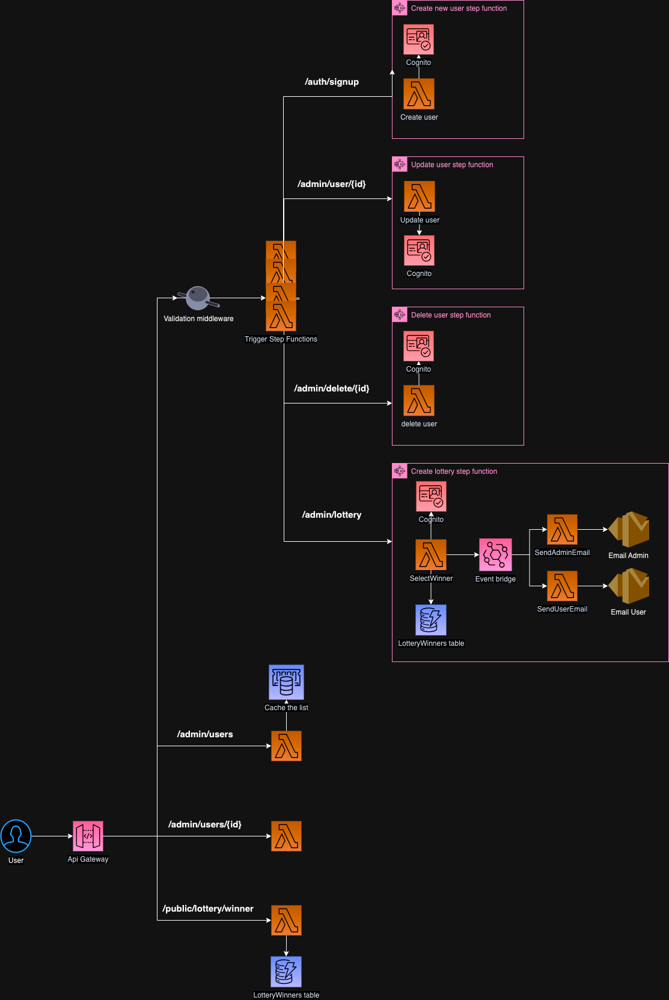

# lottery-app
This is an sst application that can be spun up in aws, this has a few endpoints which help create a basic lottery game. For more info on the api's available please check out the postman collection, sent via email. 

## Set up

SST uses your AWS credentials to run the Live Lambda Development environment and deploy your app. You can provide these credentials in several ways:

### Loading from Environment Variables
SST automatically detects AWS credentials in your environment and uses them for making requests to AWS. The environment variables that you need to set are:

```bash
AWS_ACCESS_KEY_ID: Your AWS access key ID.
AWS_SECRET_ACCESS_KEY: Your AWS secret access key.
```

This is often the most convenient way to configure credentials when deploying your SST app in a CI environment 1.

### Deploying for development 
SST has live lambda reloads and to deploy a version you can make use if this is done by 

```bash
pnpm sst dev || pnpm dev
```

This will ask you to state your stage, and you're ready to develop.

### Note

The old sst console worked a lot better for me than the new.
[https://old.console.sst.dev/](https://old.console.sst.dev/)

## Architecture

Below is a rough architecture diagram of what the application should look like. This has not all been completed at this time


## Authentication for admin

For this you will have to create a user, and confirm through the apis created. Then run this command to get an id token which is used to decode the admin status of a user. You will also need to set the custom attribute of isAdmin to true, either through the console or the command below.

```bash
aws cognito-idp admin-update-user-attributes \
    --region us-east-1 \
    --user-pool-id USER_POOL_ID \
    --username YOUR_EMAIL \
    --user-attributes Name="custom:isAdmin",Value="true"
```

I've added a jq pipe to this to make it easier, If you don't have it installed you can use brew

```bash
brew install jq
```

```bash
aws cognito-idp initiate-auth \
    --region us-east-1 \
    --auth-flow USER_PASSWORD_AUTH \
    --client-id CLIENT_POOL_ID \
    --auth-parameters USERNAME=you@email.com,PASSWORD=your_password | jq -r '.AuthenticationResult.IdToken'
```

- **CLIENT_POOL_ID** can be found from the SST console or the outputs of the dev command (UserPoolClientId).
- Use the **username** and **password** from setting up your user

## Commands

### `pnpm dev`

Starts the Live Lambda Development environment.

### `pnpm build`

Build your app and synthesize your stacks.

### `pnpm deploy [stack]`

Deploy all your stacks to AWS. Or optionally deploy, a specific stack.

### `pnpm remove [stack]`

Remove all your stacks and all of their resources from AWS. Or optionally removes, a specific stack.

## Documentation

Learn more about the SST.

- [Docs](https://docs.sst.dev/)
- [sst](https://docs.sst.dev/packages/sst)